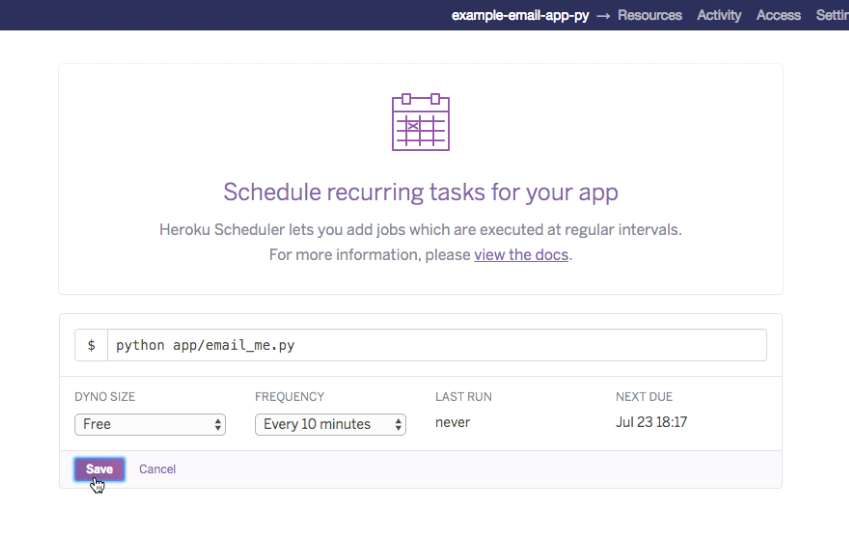

# Deployer's Guide

Follow the [Contributor's Guide](CONTRIBUTING.md) to provision a new Heroku server or gain access to an existing one.

## Deploying

Deploy the application's source code to the Heroku server:

```shell
git push heroku master
```

## Usage

Optionally run this application on the server.

First login to the server:

```shell
heroku run bash -a example-email-app-py
```

Then run the application like you normally would, except invoke the `python` CLI instead of the `python3` CLI because that's how Python has been installed on the server:

```shell
python app/email_me.py
```

## Scheduling

Optionally configure the server to schedule execution of the application at schedule intervals.

First provision the server to use the free "Scheduler" service:

```shell
heroku addons:create scheduler:standard -a example-email-app-py # specify app name only if you control multiple applications
```

Finally, find your application in the [Heroku Dashboard](https://dashboard.heroku.com/apps/), and configure it's "Scheduler" service to run the application script at specified intervals.



Now wait to see if the server sends email at the specified intervals.

## Monitoring

Monitor the server's processes:

```shell
heroku ps
```
